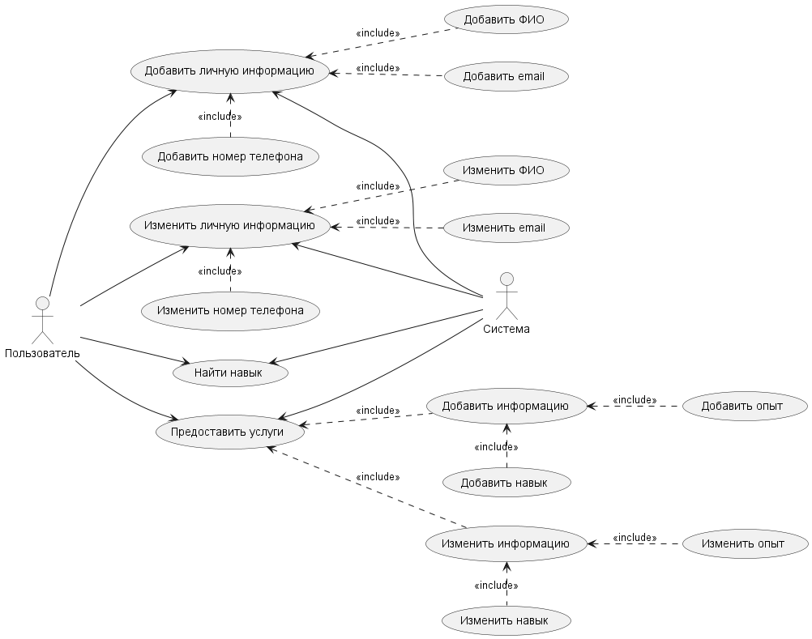
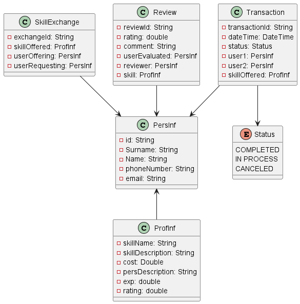
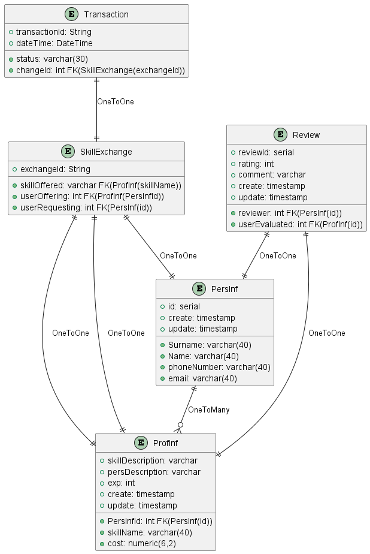
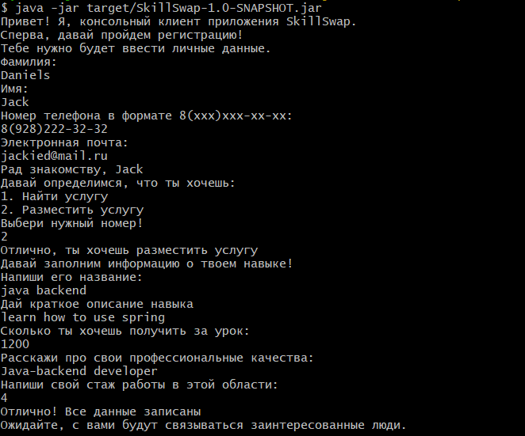
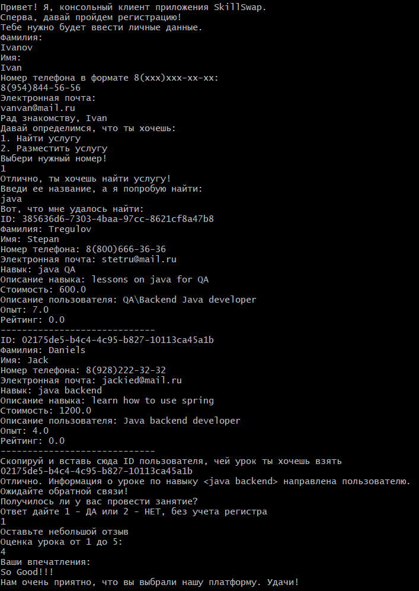
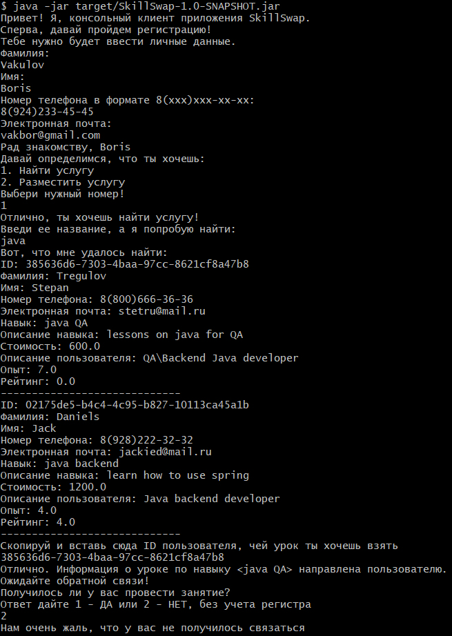

**Консольное приложение SkillSwap**
---
Данный проект был разработан в рамках дисциплины "Архитектура информационных систем".
Полный файл с перечнем заданий находится в корне проекта и называется:
>ArchPractice
---
В начале работы над проектом были составлены UML-диаграммы: диаграмма вариантов использования, диаграмма классов
и базы данных.
- Диаграмма вариантов использования: 

- Диаграмма классов:

- Диаграмма базы данных:

---

После, в проект было подключено логирование, работа с разными форматами констант таких как 
csv, xml, properties. Подключена база данных MongoDB. А также настроены CRUD-операции для данных
в формате xml и csv. Взаимодействие с реляционной базой данных осуществлено через jdbc, для каждой
модели диаграммы классов прописаны все CRUD-операции.

---
***Работа проекта:***

Консольное приложение SkillSwap предоставляет пользователям возможность найти/разместить навык, 
по которому они хотят получить/провести урок. Доступ к платформе получает пользователи прошедшие
первичную регистрацию. Все сделки между пользователями записываются в таблицы с определенным статусом:
*IN_PROCESS, CANCELED, COMPLETED*. В зависимости от статуса сделки, приложение предлагает 
пользователю оставить отзыв о проведенном уроке(рейтинг + комментарий), которые после суммируются и
добавляются в данные к преподавателю.
###### Пример работы 

- Размещение услуг преподавателем:

- Поиск услуг пользователем + успешный урок:

- Поиск услуг пользователем + несостоявшийся урок:

---

P.s. в будущем планируется реализация этого проекта на Spring и его фреймворках, по всем
правилам построения правильной архитектуры. Будут использоваться следующие фреймворки: 
Spring Security, Spring Data Jpa, Spring Boot, Spring Validator, а также ORM Hibernate. Но 
это уже будет в другом репозитории. Следите за обновлениями😄

---
Спасибо за уделённое время! Удачи!

---
_Контакты_:

-[Телеграм](https://t.me/mamin_biker)

-[Вконтакте](https://vk.com/mamin.biker)

